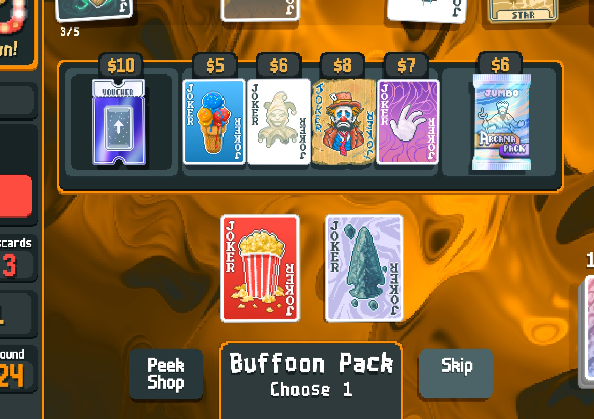
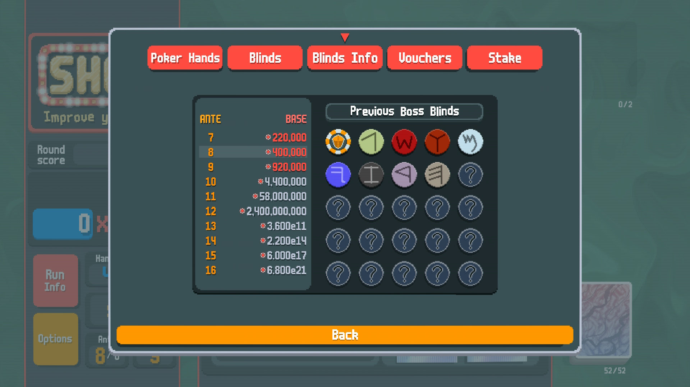
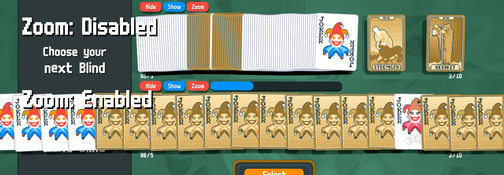

## Requirements
- [Lovely](https://github.com/ethangreen-dev/lovely-injector) - a Balatro injector.

## Installation
1. Install [Lovely](https://github.com/ethangreen-dev/lovely-injector?tab=readme-ov-file#manual-installation).
2. Download the [latest release](https://github.com/stupxd/Cartomancer/releases/) of this mod.
3. Unzip the folder, and move it into the `%appdata%/Balatro/Mods` folder.
4. Restart the game to load the mod.

## TL;DR

This mod is mainly aimed to improve your endless/heavily modded runs experience, providing quality of life & optimization features.

## Features

### 1. Limit amount of cards visible in your deck pile

### 2. Improved deck view

- Hide drawn cards
- Stack identical playing cards

### 4. Peek shop while in a Booster pack

- Quick preview on hover
- Click button to open menu and view details
- Peek shop menu has mods compatibility; I might add compatibilities with some popular mods later 

### 5. Extended Blinds info in Run Info

- Boss Blinds History
- Scoring requirements 8 ante ahead

### 6. Improved jokers management

- Option to hide all jokers (improves performance at 100+ jokers).

- Zoom into the jokers area for easier jokers management and navigation.

### 7. Custom scoring flames intensity and SFX volume.

...and more!

Settings for this mod can be found under `Mods` tab, if you use Steamodded 1.0.0 - find `Cartomancer`, and open `Config` tab.

If you play vanilla, go to `Settings` and open  tab.

## Credits

[Jen Walter](https://github.com/jenwalter666/) for the code for UI box on stacked cards.

[Mysthaps](https://github.com/Mysthaps/) for most of the initial mod config code.

