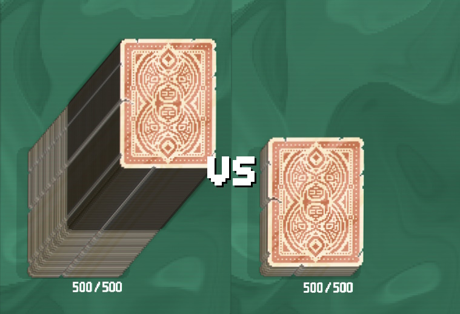
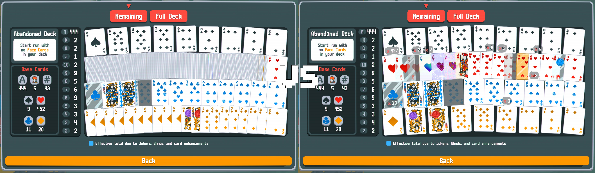

## Requirements
- [Lovely](https://github.com/ethangreen-dev/lovely-injector) - a Balatro injector.

## Installation
1. Install [Lovely](https://github.com/ethangreen-dev/lovely-injector?tab=readme-ov-file#manual-installation).
2. Download the [latest release](https://github.com/stupxd/Cartomancer/releases/) of this mod.
3. Unzip the folder, and move it into the `%appdata%/Balatro/Mods` folder.
4. Restart the game to load the mod.

## Features
1. Limit amount of cards visible in your deck pile, to make it appear smaller. Default limit is 100 cards, which can be modified in mod config menu.

2. Improved deck view

- Stack identical playing cards, which looks much cleaner and improves performance.

- Optionally, stack cards regardless of modifier, if your deck has tons of unique cards.
- Hide drawn cards from deck view

4. Custom scoring flames intensity and SFX volume.

5. Hide non-essential (edition) shaders.

Settings for this mod can be found under `Mods` tab, if you use Steamodded 1.0.0 - find `Cartomancer`, and open `Config` tab.

If you play vanilla, go to `Settings` and click lil' Cartomancer icon.

## Credits

[Jen Walter](https://github.com/jenwalter666/) for the code for UI box on stacked cards.

[Mysthaps](https://github.com/Mysthaps/) for most of the initial mod config code.

